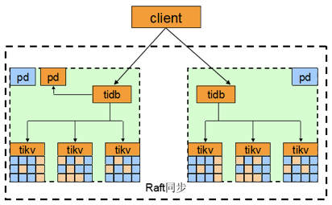

##  4.1 两中心同步复制方案（三副本）

### 4.1.1 Raft 算法

1.Raft 是一种分布式一致性算法，在 TiDB 集群的多种组件中，PD 和 TiKV 都通过 Raft 实现了数据的容灾。Raft 的灾难恢复能力通过如下机制实现：

- Raft 成员的本质是日志复制和状态机。Raft 成员之间通过复制日志来实现数据同步；Raft 成员在不同条件下切换自己的成员状态，其目标是选出 leader 以提供对外服务。
- Raft 是一个表决系统，它遵循多数派协议，在一个 Raft Group 中，某成员获得大多数投票，它的成员状态就会转变为 leader。也就是说，当一个 Raft Group 还保有大多数节点（quorum）时，它就能够选出 leader 以提供对外服务。

2.Raft 算法本身以及 TiDB 中的 Raft 实现都没有限制一个 Raft Group 的副本数，这个副本数可以为任意正整数，当副本数为 n 的时候，一个 Raft Group 的可靠性如下：

- 若 n 为奇数，该 Raft Group 可以容忍 (n-1)/2 个副本同时发生故障

- 若 n 为偶数，该 Raft Group 可以容忍 n/2 -1 个副本同时发生故障

3.在一般情况下，我们建议将 Raft Group 的副本数设置为奇数，其原因如下：

- 造成存储空间的浪费：三副本可以容忍 1 副本故障，增加 1 个副本变为 4 副本后，容灾能力维持不变。

- 当副本数为偶数时，如果发生了一个网络隔离，刚好将隔离开的两侧的副本数划分为两个 n/2 副本的话，由于两边都得不到大多数成员，因此都无法选出 leader 提供服务，这个网络隔离将直接导致整体的服务不可用。

- 当副本数为奇数时，在只发生一个网络隔离的情况中，网络隔离的两侧中总有一侧能分到大多数的成员，可以选出 leader 以提供服务。

4.遵循 Raft 可靠性的特点，放到现实场景中：

- 想克服任意 1 台服务器的故障，应至少提供 3 台服务器。

- 想克服任意 1 个机柜的故障，应至少提供 3 个机柜。

- 想克服任意 1 个数据中心（机房）的故障，应至少提供 3 个数据中心。

- 想应对任意 1 个城市的灾难场景，应至少规划 3 个城市用于部署。

可见，原生的 Raft 协议对于偶数副本的支持并不是很友好，同城 3 中心或许是最适合部署 Raft 的高可用及容灾方案。而在现实情况中，大多数采用 on-premise 部署的用户中，很少具备同城 3 中心的条件。比如数字化程度非常高的银行业，基于传统单机系统点对点复制的特性，绝大多数银行都只建设了同城 2 中心，两地 3 中心的基础设施。

在同城两中心部署原生的 Raft，主备机房按 2:1 的比例来分配 3 个副本，由于网速的差异，备机房会存在异步复制的副本。当主机房由于故障无法恢复时，备机房仅剩的个副本是无法保障 ACID 中的一致性的。

TiKV 对 Raft 做了一些功能上的扩展，基于这个扩展它可以在一定程度上克服主机房故障后使用备机房难以恢复一致性数据的难题。但在这之前，我们先介绍一个基于原生 Raft 偶数副本的双机房部署方案。

### 4.1.2 两中心单集群偶数副本方案

两中心单集群方案，即两种数据中心只部署一个 TiDB 集群，两中心间的数据同步通过集群自身内部（Raft 协议）完成。两中心可同时对外进行读写服务，任意中心发生故障不影响数据一致性。需要注意的是这样的部署方式不仅在设备资源上需要对称部署，副本也需对称，即两中心副本数相同，整个集群为偶数副本。

如上图所示，假设每个中心有 3 个数据副本，整个集群 6 副本，任意一个中心发生灾难，虽然会短暂影响业务连续性，但因为 Raft 协议下多数副本数据强一致的特性，数据不会丢失，而且可以通过降低副本数实现快速恢复业务，即把集群改成 3 副本拉起业务。

**优势：**

- 保证两中心数据一致性。

- 两中心同时对外提供服务，资源使用合理。

**劣势：**

- 两中心间网络传输延迟会对集群性能带来影响，不建议远程异地中心使用该架构方案。

- 缺少降级服务机制，机房间网络故障或任一机房整体故障都会导致服务中断，需要通过人工介入的方式来恢复数据，虽然 RPO（Recovery Point Objective）业务系统所能容忍的数据丢失量为 0，但 RTO（Recovery Time Objective）灾难发生到恢复的的时长较高。

### 4.1.3 两中心单集群三副本同步复制方案

原生的 Raft 协议无法通过人工来干预一个 Raft Group 的 quorum（大多数），quorum 只能通过 Raft Group 最初的的副本数设置自动生成。为了弥补以上方案缺少降级服务的能力不足，TiKV 中提供了配置 Raft Group 的 quorum 属性的接口，并推出了一个全新的方案，该方案采用两中心三副本按照 2:1 方式进行部署，不限定 Raft leader 位置，初始配置 quorum 为 3，即同步写三副本，当发生单个网络隔离时自动缩减 quorum 到 2，让集群继续提供服务。

#### 1. TiKV 技术细节
TiKV 已具备 custom quorum 接口，可供运行时动态修改 quorum。初始化时，采用 Q1(n) = floor((n + 1) / 2) + 1 配置 quorum，譬如三副本 quorum 就是 3。这样保证所有节点写入时才能响应，即 leader 和所有 follower 都写完。

#####  (1) 网络隔离时

TiKV 提供配置项 `max-idle-time` 可以控制一个 region 所在的 raft group 中 没有 leader 的最长时间。 通过调整配置项 `max-idle-time` 的大小可以切换数据保护模式（类似 Oracle
 DG 的最大可用/最大性能/最大保护模式）。如果一个 region 所在的 raft group 长时间没有 leader，则将 quorum 修改为 Q2(n) = floor(n / 2) + 1。三副本情况下，只需要 2 个副本存活即可工作。等所有副本的日志都复制到当前 term 且副本间的 Raft log gap 小于指定值以后，就可以识别为所有副本可回到同步复制模式，重新把 quorum 修改为 Q1(n)，这个修改由 PD 自动完成。

##### (2) 性能开销

本方案在三副本的情况下，写入需要全部落盘才能响应请求，所以写入性能会有所下降。（根据 5 副本 & 3 副本性能对比测试，写入性能衰减在 5% 以内）。

#### 2. TiDB，PD 部署方式

TiDB 采用一般的高可用方式部署，在两个机房部署若干 tidb-server，各自连接到各自机房的负载均衡器对外提供服务。
PD 采用一般的三副本 2:1 部署，不增加 quorum 配置，主机房故障时通过人工重建恢复 PD 服务（pd-recover）。

#### 3. 应用部署技术细节

主机房承载两个数据副本，灾备机房承载一个数据副本。应用可以部署在两个机房，连接到各自机房的负载均衡器，需要注意的是阻塞窗口 `max-idle-time` 的设置不应太短，为了防止在极端情况下的数据丢失。当应用在主机房启动时，它不需要灾备机房参与也可以正常工作，当两机房网络断开一段时间，数据复制由同步转为异步后，应用还可以正常工作，假设此时主机房整体故障，那么灾备机房的数据是不可用的。设想一次机房故障的开始于两机房的数据库专用网络，继而发展为全机房故障，就会遇到这个情况。

### 4.1.4 应急处置预案

##### (1) 两机房间网络断开

网络抖动期间，在阻塞窗口 `max-idle-time` 时间内，应用请求被阻塞，此时会有网络延迟相关报警发出，用户收到数据库和应用的报警并根据报警定位问题及产生原因。网络连接在 `max-idle-time` 时间内恢复的话，应用阻塞也会随之解除，所有 region 继续保持同步复制状态。假设网络断开超过 `max-idle-time`，应用阻塞会被解除，同时数据库发出同步复制转为异步复制的报警，待用户定位问题并恢复网络后，集群可以自动转为同步复制状态，并发出异步复制转为同步复制的报警解除。

##### (2) 灾备机房整体宕机

灾备机房整体宕机，主机房的 TiKV 无法继续保持同步复制模式，进入阻塞窗口，在阻塞窗口 `max-idle-time` 时间内，应用请求被阻塞此时会有网络延迟相关报警发出（主机房一侧无法判断是网络故障还是灾备机房故障，只会以网络延迟报警形式发出），用户收到数据库和应用的报警并根据报警定位问题及产生原因。超过 `max-idle-time`，应用阻塞会被解除，同时数据库发出同步复制转为异步复制的报警，机房整体故障需要较长时间恢复，数据库在这期间会持续发出网络连接相关报警，可以进入报警系统暂时人为禁用相关报警，集群此时处于两副本的状态，在灾备机房离线时间超过 `max-store-down-time` 之后，PD 会在可用的位置上补齐离线的第三个副本，副本补齐速度视 PD 调度参数而定。待用户恢复灾备机房后，集群可以自动将副本调度会灾备机房，继而转为同步复制状态，并发出异步复制转为同步复制的报警解除。用户需要进入报警系统恢复之前禁用的网络延迟报警。

##### (3) 主机房整体宕机

主机房整体宕机，TiKV 由于 region 丢失了大多数副本而停止服务，旁路报警系统发出网络延迟过高相关报警，用户收到数据库和应用的报警并根据报警，并确认主机房整体故障，并难以在短时间内恢复。使用 `pd-recover` 重建 PD（参考官方手册，并定期演练以确保流程的可用），使用 `tikv-ctl` 从仅存的一副本恢复数据（参考官方手册，并定期演练以确保流程的可用），数据恢复后通过客户端连接到数据库服务，确保数据库可用后启动应用到数据库的连接，恢复业务。接下来的操作视灾备机房环境而定，如果可以提供冗余的服务器，可以在线操作集群的扩容与扩充副本。待主机房恢复之后，需要确保主机房部署的集群进程保持停止的状态，并清除主机房的全部组件的部署目录，之后通过扩容的方式将主机房纳入到集群中，扩副本的操作可以与扩容操作同步进行。

#### 4. 关于 RPO 和 RTO

- RPO = 0

   - 排除数据同步转异步，降级以提供服务之后继而发生主机房整体故障的情况，可以实现数据 0 丢失。

- RTO 在不同的场景下的计算方法：

    - 当两机房网络断开时，RTO 为阻塞窗口 `max-idle-time` 所设置的时间。

    - 当灾备机房整体宕机时，RTO 为阻塞窗口 `max-idle-time` 所设置的时间。

    - 主机房整体宕机恢复时间为，RTO 为报警响应时间、重建 PD 操作时间（熟练 DBA 分钟级）、恢复 TiKV 单副本时间（熟练 DBA 分钟级）、集群验证时间（用于验证数据库可用，应用连接顺畅）的总时常，恢复后的单副本集群可以直接提供服务，后续的扩容以及扩副本操作可以在线执行。