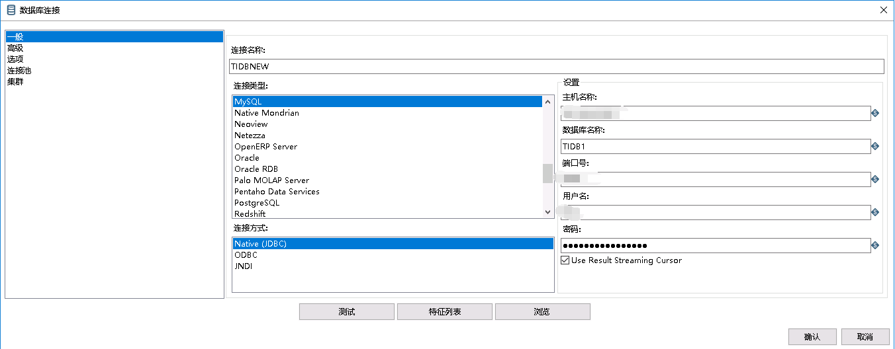
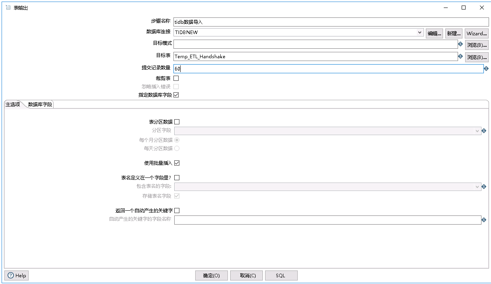
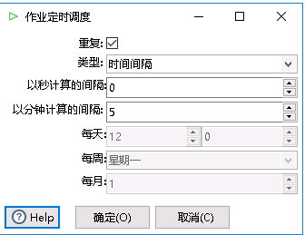
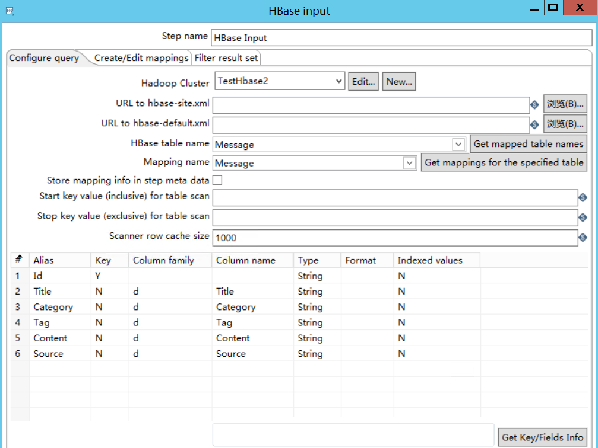
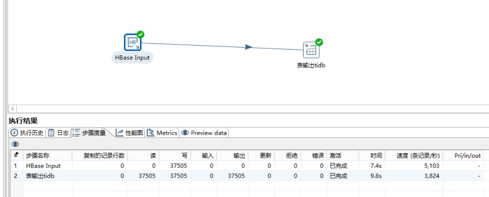
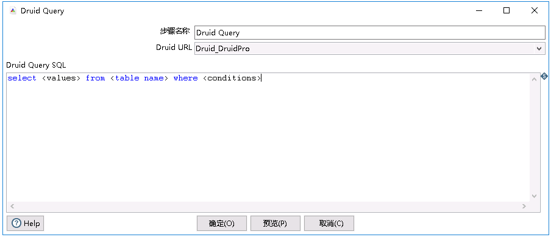

## 6.6 TiDB 与 HBase、ES、Druid  的数据交互实战

大数据生态组件可谓是百花齐放，百家争鸣，由于时间和技术的原因，企业多会部署多类大数据基础组件，上了 TiDB 之后，如何实现 TiDB  与现有大数据生态的数据库进行互联互通呢？大家可能会有不同的方案来实现，本章主要讨论如何使用利用现有的开源工具高效低成本的实现 TiDB 与现有大数据组件比如 Hbase、ES、Druid  进行数据交互。实现不同类型的数据库之间的数据互联互通，从平台和工具层次看主要解决方案是使用 ETL 工具。这里 ETL 我们主要使用 Kettle 。主要介绍如何使用 Kettle 实现 TiDB 与 HBase、ES、Druid 之间实现数据交互。

## 6.6.1. ES 数据导入 TiDB

   主要实现将 ES 的数据以数据流的方式抽取到内存，经过一系类处理之后，以流的方式保存到 TiDB  ，主要使用到的 Kettle 的组件为：tableinput、Elasticsearch Query（扩展插件）。

下面将在 ES 的表 `bmsshakehandsinfo_202003` 每天定时导入 TiDB 的数据库中的表 `Temp_ETL_Handshake`。

### 1. ES 的查询设置

  如下图 1 所示，通过 ES 查询组件设置需要查询的 SQL。从 ES  数据库获取数据是采用分批的方式获取的。可以通过界面设置每次获取数据的条数大小。其中 SQL  查询可以通过采用 Kettle 变量的形式进行参数的动态传递 如下图 2 所示。
  
   								
**图1**

   
**图2**

### 2. TiDB 的查询组件设置

   将数据写入 TiDB，主要采用 Kettle 内置的 `tableout` 插件相关的设置如下。
##### 2.1 数据源设置

   Kettle 里面设置 TiDB 的数据源直接采用 Kettle 内置的 MySQL 数据驱动即可。如下图 3 所示
   
   
**图3**

##### 2.2 TiDB 数据保存设置

TiDB 的数据保存设置界面如图 4 所示，设置对应的数据库、数据库表以及每次提交的数据量。相关参数注意事项如下：

- 提交的数据量

    1. 需要结合 TiDB 的事务大小对应处理，一般建议每次处理的条数在60-100.（可以根据硬件资源情况和事务设置进行调整）

    2. 设置条数的同时，可以通过设置此插件运行时复制的个数进行性能提升，充分利用TiDB的高并发特性

- 忽略插入错误

     1. 对于插入过程中出现的错误，可以选择插入过程中忽略或者默认停止

     2. 如果插入过程中针对重复数据进行更新，可以采用 Kettle 的插入/更新步骤,由于此插件没有实现 TiDB  支持的 on duplicate 语法，如果需要性能较高，可以通过开发插件的方式，进一步提升插入的性能

   
**图4**

#### 3. 数据处理流程设置

通过 Kettle 的转换流程，将上述步骤设置的 ES 的数据抽取、TiDB 的数据导入以流程的方式进行数据流的处理，当然中间可以进行复杂的清洗和转换设置，这里不做重点描述。数据流设置界面图 5 所示，其中 60 代表数据流程执行时，同时运行 60 个插入的实例，向 TiDB 进行高速的写入数据。

   
**图5**

 通过 Kettle 的定时器，可以设置流程的执行时间。如图 6 所示。
 
     
 **图6**
 
以上完整的定义了通过 Kettle 工具，按需定时的将数据从 ES 以流的方式导入到 TiDB 。

### 6.6.2 Hbase 数据导入 TiDB

 Hbase 的数据导入 TiDB ，主要使用的步骤为 Kettle  内置的 HbaseInput、TableOutPut。其中数据导入到 TiDB 的 TableOutPut 同 ES 导入 TiDB 类似，不在赘述。

数据源设置是直接采用 Kettle 的 HBase input 组件,如图 7,选择 Hbase 集群链接、获取对应的表名和 mapping 列表。
     
**图7**
   
**图8**

### 6.6.3 Druid 数据导入 TiDB

   Druid 的数据导入 TiDB ，主要使用的步骤为 Druid  查询组件（扩展开发）、TableOutPut。其中数据导入到 TiDB 的 TableOutPut 同 ES 导入 TiDB  类似，不在赘述。Druid 的查询组件设置如下，通过该组件可以通过设置 Druid SQL  的方式进行数据源的抽取。
  
   
**图9**
